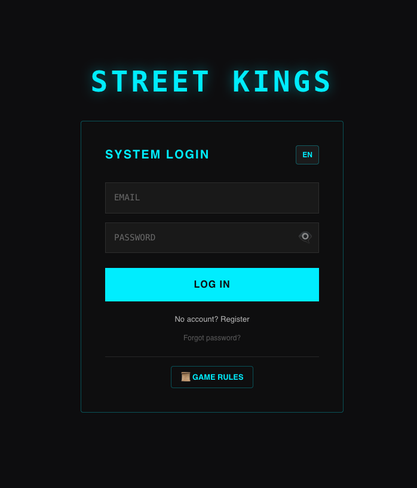
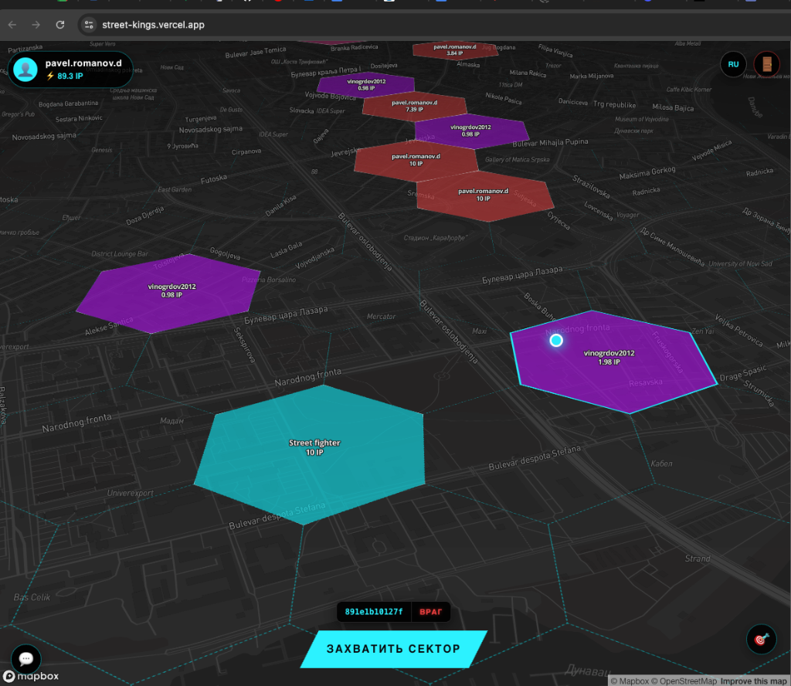

# 🏙️ STREET KINGS

**STREET KINGS** is an ambitious location-based MMO strategy game. Players capture real-world urban territories, expand their influence, and battle for the title of "King of the Streets" using an interactive world map.

🔗 **Project Demo:** [https://street-kings.vercel.app/](https://street-kings.vercel.app/)

---

## 🚀 Key Features

- **Real-time Geolocation Map:** Full-screen interactive map powered by Mapbox GL JS, synced with your real-world position. 🏹
- **Hexagonal Grid Intelligence:** A custom grid system dividing the world into tactical sectors using axial coordinates. 🗺️
- **Physical Presence Capture:** True street control. Captured or attack actions are only possible if you are physically present in the sector. 📍
- **Dynamic Economy:** Earn Intelligence Points (IP) from your sectors. Manage storage limits, fortify nodes, and harvest resources in real-time. ⚡
- **Communications Hub:**
  - **Global Frequency:** Real-time chat with all nearby kings.
  - **Encrypted DMs:** Private messaging system with organized "Mailbox" conversations.
  - **Intel Alerts:** Visual pulse notifications for incoming messages. 🚨
- **Deep Customization:** Personalize your profile with a unique "Street Name" and tactical colors to mark your turf. 🎨
- **Encrypted Access:** Full authentication system with secure profile management and multi-language support (EN/RU). 🛡️

## 🛠 Tech Stack

- **Framework:** [Nuxt 3](https://nuxt.com/) (Vue.js 3 Composition API)
- **State:** [Pinia](https://pinia.vuejs.org/)
- **Backend & DB:** [Supabase](https://supabase.com/) (PostgreSQL + Realtime + RLS)
- **Maps API:** [Mapbox GL JS](https://www.mapbox.com/mapbox-gl-js)
- **Styles:** SCSS (SASS) with a modular variable system.
- **Architecture:** [Feature-Sliced Design (FSD)](https://feature-sliced.design/)

---

## 📂 Project Structure (FSD)

The project architecture ensures maximum scalability and clean code separation:

- `src/app` — Global initialization, styles, and Nuxt plugins.
- `src/pages` — Game screens (Map View, Authentication).
- `src/widgets` — Complex UI modules (`TheMap`, `ChatWidget`, `ZoneInfoModal`).
- `src/features` — Core user scenarios (Capture logic, Profile updates, Bonus collection).
- `src/entities` — Logic and state for game objects (Zones, User Profiles).
- `src/shared` — Reusable toolkits, Mapbox configs, and coordinate utilities.

